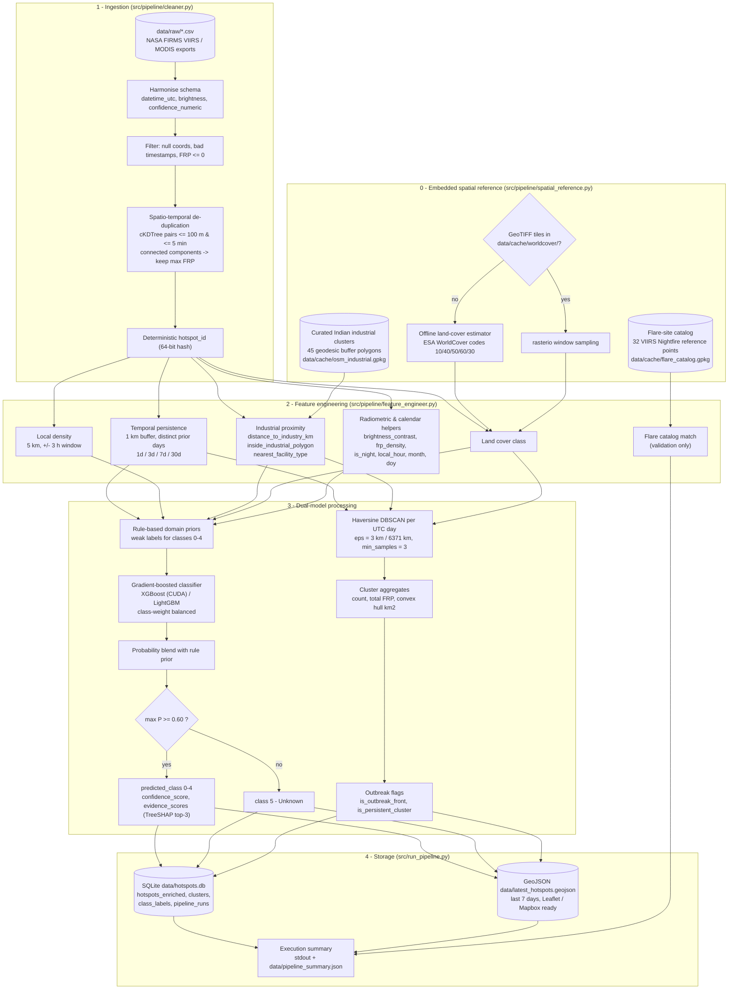

# SIH26162 - AI-Based Detection and Classification of Industrial Fires and Persistent Thermal Sources

**Pipeline & model documentation** (NTRO problem statement, Smart India Hackathon 2026)

This document describes the fully offline ML and geospatial pipeline that turns raw NASA FIRMS
active-fire exports into a classified, clustered hotspot database (`data/hotspots.db`) and a
map-ready GeoJSON layer (`data/latest_hotspots.geojson`). The pipeline never opens a network
socket: every reference dataset it needs (industrial zones, land cover, flare sites) is embedded
in code and cached locally.

---

## 1. Architecture flowchart



### Module map

| Stage | Module | Key entry point |
|---|---|---|
| 0 Reference | `src/pipeline/spatial_reference.py` | `SpatialReference` |
| 1 Cleaning | `src/pipeline/cleaner.py` | `clean(raw_dir, years, max_rows, sample_frac)` |
| 2 Features | `src/pipeline/feature_engineer.py` | `engineer_features(df, spatial_ref)` |
| 3a Classifier | `src/ml/classifier.py` | `FireClassifier.fit / predict`, `assign_rule_labels` |
| 3b Clustering | `src/ml/anomaly_detector.py` | `run_anomaly_detection(df)` |
| 3c Console export | `src/export/console_export.py` | `build_console_records(df)`, `write_console_json(...)` |
| 4 Runner | `src/run_pipeline.py` | `python src/run_pipeline.py` |
| Constants | `src/config.py` | paths, thresholds, class labels |

### Running

```bash
python -m pip install -r requirements-pipeline.txt
python src/run_pipeline.py                   # full archive in data/raw (2020-2024, ~6 M rows)
python src/run_pipeline.py --reuse-model     # refresh every output without retraining (~6 min)
python src/run_pipeline.py --years 2024      # single year (~85 s)
python src/run_pipeline.py --quick           # 5 % random sample smoke test
python src/run_pipeline.py --backend lightgbm --no-evidence   # CPU-only, fastest
```

All flags: `--raw-dir`, `--years`, `--max-rows`, `--sample-frac`, `--quick`, `--backend {xgboost,lightgbm}`,
`--device {auto,cpu,cuda}`, `--threshold`, `--rule-prior-weight`, `--max-per-class`, `--no-evidence`,
`--reuse-model`, `--eps-km`, `--min-samples`, `--geojson-days`, `--geojson-max-features`, `--db`,
`--geojson`, `--clusters-geojson`, `--console-json`, `--console-max-records`, `--console-min-per-class`,
`--no-console-json`, `--summary-json`, `--model-path`, `--worldcover-dir`, `--rebuild-reference`,
`--log-level`.

The FastAPI backend (`backend/app.py`) reads `data/hotspots.json` (section 2.7) and falls back to
`mock/hotspots.json` when that export is absent; its routes and the frontend logic are unchanged.

---

## 2. Schema & feature dictionary

### 2.1 Harmonised FIRMS schema (`cleaner.py`)

| Column | Type | Unit / values | Description |
|---|---|---|---|
| `hotspot_id` | TEXT (16 hex) | - | Deterministic 64-bit hash of (satellite, datetime, lat, lon); stable across runs |
| `latitude`, `longitude` | REAL | degrees WGS 84 | Pixel centre |
| `acq_date` | TEXT | `YYYY-MM-DD` | Acquisition date (UTC) |
| `acq_time` | TEXT | `HHMM` | Acquisition time (UTC), zero-padded |
| `datetime_utc` | TEXT (ISO 8601) | UTC | `acq_date` + `acq_time` combined |
| `brightness` | REAL | Kelvin | `bright_ti4` (VIIRS I-4, 3.74 um) or MODIS `brightness` (band 21/22) |
| `bright_t31` | REAL | Kelvin | `bright_ti5` (VIIRS I-5, 11.45 um) or MODIS `bright_t31` |
| `scan`, `track` | REAL | km | Pixel footprint along scan / track |
| `satellite` | TEXT | Suomi-NPP, NOAA-20, NOAA-21, Terra, Aqua | Platform (FIRMS codes N / N20 / N21 / T / A expanded) |
| `instrument` | TEXT | VIIRS, MODIS | Sensor |
| `confidence` | TEXT | `l`/`n`/`h` or `0-100` | Raw FIRMS confidence as delivered |
| `confidence_numeric` | REAL | 0-100 % | Harmonised: VIIRS `l -> 30`, `n -> 60`, `h -> 90`; MODIS numeric passthrough; missing -> 50 |
| `frp` | REAL | MW | Fire radiative power; rows with `frp <= 0` are dropped |
| `daynight` | TEXT | `D` / `N` / `U` | Day / night overpass |
| `firms_type` | INTEGER | -1, 0, 1, 2, 3 | FIRMS standard-product type: 0 vegetation fire, 1 volcano, 2 other static land source, 3 offshore; -1 when absent (NRT). **Not** a model feature |
| `source_file` | TEXT | - | Originating CSV |

**De-duplication.** Points are placed on a 3-D unit sphere (metres) and `cKDTree.query_pairs(r = 100 m)`
finds co-located pings; pairs further than 5 min apart are discarded; the remaining pairs are linked by
`scipy.sparse.csgraph.connected_components` and the member with the highest FRP survives. On the
2020-2024 archive this merges 53,822 of 6,020,802 rows (0.9 %).

### 2.2 Engineered features (`feature_engineer.py`)

| Feature | Type | Unit | Definition |
|---|---|---|---|
| `persistence_1d` | INTEGER | days (0-1) | Number of **distinct prior UTC days** in the trailing 1-day window with >= 1 detection within 1.0 km |
| `persistence_3d` | INTEGER | days (0-3) | Same, trailing 3 days |
| `persistence_7d` | INTEGER | days (0-7) | Same, trailing 7 days |
| `persistence_30d` | INTEGER | days (0-30) | Same, trailing 30 days (cloud-tolerant multi-week persistence) |
| `prior_detections_7d` | INTEGER | count | Raw detections within 1 km in the trailing 7 x 24 h (strictly earlier) |
| `same_day_detections` | INTEGER | count | Other detections within 1 km on the same UTC day (SNPP + NOAA-20, day + night agreement) |
| `hotspot_density` | INTEGER | count | Other detections within 5 km inside a 6-hour window centred on the detection (+/- 3 h) |
| `distance_to_industry_km` | REAL | km | Great-circle distance to the nearest industrial polygon boundary; 0 when inside |
| `inside_industrial_polygon` | INTEGER | 0/1 | 1 if the point lies inside an industrial polygon |
| `nearest_facility_type` | TEXT | see 5.1 | Facility type of the nearest polygon |
| `nearest_facility_name`, `nearest_facility_id` | TEXT | - | Nearest facility identity |
| `land_cover_class` | INTEGER | ESA WorldCover code | 10 tree cover, 20 shrubland, 30 grassland, 40 cropland, 50 built-up, 60 bare/sparse, 80 water, 95 mangroves |
| `land_cover_name` | TEXT | - | Human-readable class name |
| `brightness_contrast` | REAL | K | `brightness - bright_t31` (fire-channel excess over background) |
| `frp_density` | REAL | MW / km^2 | `frp / (scan x track)` - FRP normalised by pixel area |
| `is_night` | INTEGER | 0/1 | Night overpass |
| `local_hour` | REAL | hours (IST) | UTC + 5:30 |
| `month` | INTEGER | 1-12 | Calendar month (seasonality) |
| `doy_sin`, `doy_cos` | REAL | - | Cyclic encoding of day-of-year |
| `distance_to_flare_site_km`, `near_flare_site`, `flare_site_id` | REAL / INTEGER / TEXT | km, 0/1 | Nearest embedded flare-catalog site; validation helpers, **not** model inputs |

**Rationale (VIIRS Nightfire).** Gas flares and smelters radiate continuously, so the same 1 km cell is
re-detected on almost every clear overpass for weeks; a vegetation or crop fire rarely re-fires the same
cell on more than one or two consecutive days. Counting distinct prior days (instead of raw pings)
makes the feature insensitive to the number of satellites and overpasses per day.

**Implementation.** Both persistence and density use `scipy.spatial.cKDTree.sparse_distance_matrix`
between a *query block* (10 days for persistence, 1 day for density) and its *reference window*
(block + 30-day look-back, or day +/- 3 h). Pairs are filtered on time deltas and reduced with
`np.unique` / `np.bincount`; nothing is looped per point. On the full archive (5.97 M rows) the
persistence pass evaluates 166 M candidate pairs in 29 s and the density pass 74 M pairs in 8 s.

### 2.3 Classification outputs (`classifier.py`)

| Column | Type | Description |
|---|---|---|
| `predicted_class` | INTEGER | 0 Wildfire, 1 Agricultural burning, 2 Industrial fire, 3 Gas flare, 4 Persistent thermal source, 5 Unknown |
| `predicted_label` | TEXT | Label for `predicted_class` |
| `confidence_score` | REAL | `max(P)` after prior blending (also stored for class 5, where it is < 0.60) |
| `prob_class_0..4` | REAL | Full posterior over the five learned classes |
| `rule_prior_class` | INTEGER | Class assigned by the domain-prior rules, -1 if no rule fired |
| `evidence_scores` | TEXT (JSON) | Top-3 TreeSHAP contributions for the model's arg-max class, e.g. `{"persistence_30d": 3.37, "is_flare_zone": 2.59, "facility_type_code": 0.71}` (log-odds units) |

### 2.4 Cluster outputs (`anomaly_detector.py`)

Per hotspot: `cluster_id` (-1 = noise / singleton; globally unique integer across days),
`cluster_fire_count`, `total_cluster_frp` (MW), `cluster_convex_hull_area_km2`, `is_outbreak_front`,
`is_persistent_cluster`.

Table `clusters` (one row per cluster): `cluster_id`, `cluster_date`, `cluster_fire_count`,
`total_cluster_frp`, `max_frp`, `cluster_convex_hull_area_km2`, `centroid_lat`, `centroid_lon`,
`mean_persistence_7d`, `share_forest_shrub`, `share_industrial`, `dominant_land_cover`,
`dominant_class`, `dominant_label`, `is_outbreak_front`, `is_persistent_cluster`.

### 2.5 Storage layout

**SQLite `data/hotspots.db`**

| Table | Content |
|---|---|
| `hotspots_enriched` | One row per de-duplicated hotspot with all columns from 2.1-2.4 (indexes on `acq_date`, `predicted_class`, `cluster_id`, `(latitude, longitude)`; rows are inserted in `datetime_utc` order) |
| `clusters` | Cluster aggregates (2.4) |
| `class_labels` | `class_id -> label` lookup |
| `pipeline_runs` | `run_id`, `run_utc`, full JSON summary of the run |

**GeoJSON `data/latest_hotspots.geojson`** - `FeatureCollection` of Point features for the most recent
`--geojson-days` (default 7) of data, capped at `--geojson-max-features` (default 50,000; anomaly-flagged
and confidently classified points are kept first). Feature `properties` carry the identity, radiometry,
prediction, evidence, persistence, land-cover, industry and cluster fields; the top-level `metadata`
member lists the run id, time window, class labels, threshold and the cluster summaries present in the
window. Coordinates are `[lon, lat]` (CRS84), directly consumable by Leaflet `L.geoJSON` or a Mapbox
`geojson` source.

**GeoJSON `data/latest_clusters.geojson`** - companion layer with one Polygon feature per DBSCAN cluster
present in the same window (convex hull in lon/lat, degenerate hulls buffered by 0.002 deg so they
render). Properties are the `clusters` table row (`cluster_fire_count`, `total_cluster_frp`,
`cluster_convex_hull_area_km2`, `mean_persistence_7d`, `dominant_label`, `is_outbreak_front`,
`is_persistent_cluster`, ...), so outbreak fronts and persistent industrial clusters can be styled
directly.

### 2.6 Integration notes for the FastAPI backend

`backend/app.py` serves `data/hotspots.json` when it exists and `mock/hotspots.json` otherwise. The
mapping below is what `src/export/console_export.py` (section 2.7) implements to turn pipeline columns
into that console schema; it also applies to anyone reading `data/hotspots.db` or the GeoJSON
`properties` directly. No API route had to change.

| Mock field | Pipeline column | Note |
|---|---|---|
| `id` | `hotspot_id` | 16-hex deterministic id |
| `lat`, `lon` | `latitude`, `longitude` | |
| `acq_date`, `acq_time` | `acq_date`, `acq_time` | `acq_time` is `HHMM`; `datetime_utc` is the ISO timestamp |
| `satellite` | `satellite` + `instrument` | e.g. `NOAA-20` + `VIIRS` |
| `brightness_temperature` | `brightness` | Kelvin (I-4 / band 21) |
| `frp` | `frp` | MW |
| `confidence` | `confidence_numeric` | 0-100 |
| `day_night` | `daynight` | `D` / `N` |
| `persistence_1d/3d/7d` | same names | day counts per window (identical semantics to `get_persistence()`) |
| `distance_to_industry_km`, `inside_industrial_polygon` | same names | `inside_industrial_polygon` is 0/1 |
| `nearest_facility_type` | `nearest_facility_type` (+ `nearest_facility_name`) | snake_case type codes, see 5.1 |
| `land_cover_class` | `land_cover_name` (`land_cover_class` holds the numeric ESA code) | |
| `hotspot_density` | `hotspot_density` | |
| `classification` | `predicted_label` (`predicted_class` numeric) | includes `Unknown` |
| `classification_confidence` | `confidence_score` | 0-1 |
| `evidence` | `evidence_scores` (JSON of top-3 SHAP contributions) + context columns | rendered as sentences by `console_export.build_evidence` |
| `risk_score` | derived by `console_export.compute_risk_score` | formula `risk-v1`, section 2.7 |

### 2.7 Console export (`data/hotspots.json`)

`src/export/console_export.py` writes the operator-console dataset the backend loads at startup. It
selects the latest `--geojson-days` (7) days of detections, caps them at `--console-max-records`
(3,000, so the Leaflet console can render one marker per record) after reserving up to
`--console-min-per-class` (40) highest-priority rows per class so rare classes (Industrial fire,
Unknown) survive the cap, and maps every row onto the mock record shape.

**File shape**

```json
{"hotspots": [ {...console record...}, ... ],
 "metadata": {"schema_version": "console-1", "generated_utc": "...", "run_id": "...",
              "window_days": 7, "window_start_utc": "...", "window_end_utc": "...",
              "candidates_in_window": 15523, "cap": 3000, "min_per_class": 40,
              "record_count": 3000, "class_distribution": {...},
              "risk_formula": {"version": "risk-v1", "weights": {...}},
              "facility_context_km": 25.0, "confidence_threshold": 0.6, "source_db": "..."}}
```

**Record conversions**

| Console field | Source | Conversion |
|---|---|---|
| `id` | `hotspot_id` | as is (16 hex) |
| `lat`, `lon` | `latitude`, `longitude` | 5 dp |
| `acq_date`, `acq_time` | `acq_date`, `acq_time` | `HHMM` -> `HH:MM` |
| `satellite` | `satellite` + `instrument` | `VIIRS_SNPP`, `VIIRS_NOAA20`, `VIIRS_NOAA21`, `MODIS_TERRA`, `MODIS_AQUA` |
| `brightness_temperature` | `brightness` | K, 1 dp |
| `frp` | `frp` | MW, 2 dp |
| `confidence` | `confidence_numeric` | int 0-100 |
| `day_night` | `daynight` | `D` / `N` |
| `persistence_1d/3d/7d` | same | int day counts |
| `distance_to_industry_km` | same | km, 2 dp, never null |
| `inside_industrial_polygon` | same | real JSON boolean |
| `nearest_facility_type` | `nearest_facility_type` | label map below; `null` when distance > 25 km |
| `land_cover_class` | `land_cover_class` (ESA code) | ESA class name (`Tree cover`, `Cropland`, `Built-up`, ...) |
| `hotspot_density` | same | int |
| `classification` | `predicted_class` | `Wildfire`, `Agricultural Burning`, `Industrial Fire`, `Gas Flare`, `Persistent Thermal Source`, `Unknown` |
| `classification_confidence` | `confidence_score` | 0-1, 4 dp |
| `class_probabilities` | `prob_class_0..4` | `{label: p}` over the five learned classes (sums to 1); Unknown is the gate, so it has no entry. The console's Investigation page renders these bars |
| `risk_score` | derived | formula below, int 0-100 |
| `evidence` | derived | 3-6 unique sentences |

Facility labels: `oil_gas_flare`, `gas_processing`, `lng_terminal` -> `Oil & Gas`; `refinery*` ->
`Refinery`; `chemical_refinery`, `petrochemical` -> `Chemical Plant`; `power_coal` -> `Power Plant`;
`steel_smelter` -> `Steel Plant`; `coal_mining_fire` -> `Coal Mine`; `industrial_unknown` ->
`Industrial Area`. The first three are the labels the console's "Gas flare candidates" saved query
matches. Because the embedded reference layer has only 45 polygons, a facility hundreds of km away is
not context, hence the 25 km null rule; `distance_to_industry_km` itself is always populated so the
backend's proximity buckets count every record.

**Risk score (`risk-v1`)**, deterministic, all terms in points:

$$
\text{risk} = \operatorname{clip}\Big(\text{prior}_c + 30\min\!\big(1, \tfrac{\ln(1+F)}{\ln 31}\big)
+ 10\,\tfrac{\min(p_7, 7)}{7} + 14\,\pi + 14\,o + 5\,s + 8\min\!\big(1, \tfrac{\ln(1+n)}{\ln 51}\big) + 5\,q,\ 0,\ 100\Big)
$$

with class prior $\text{prior}_c$ = Industrial Fire 55, Wildfire 35, Persistent Thermal Source 28,
Gas Flare 22, Agricultural Burning 12, Unknown 8; $F$ = FRP (MW); $p_7$ = `persistence_7d`;
$\pi = 1$ inside an industrial polygon, else $\max(0, 1 - d/5\,\text{km})$; $o$ = `is_outbreak_front`;
$s$ = `is_persistent_cluster`; $n$ = `cluster_fire_count`; $q$ = `confidence_score`. On the
2024-12-24..31 window the capped export scores 1.5 % of records >= 90 (backend status NEEDS
INVESTIGATION), 25 % in 80-89 (NEW), 62 % in 50-79 and 11 % below 50, with class medians Industrial
Fire 100, Persistent Thermal Source 78, Wildfire 75, Gas Flare 73, Agricultural Burning 49, Unknown 43.
The weights live in `RISK_WEIGHTS` and are embedded in the file's metadata.

**Evidence sentences** are built in three tiers and de-duplicated: (1) the top-3 TreeSHAP attributions
from `evidence_scores`, each rendered as "Model attribution: <feature phrase> supports / argues against
the <class> call (+x.xx)" (for gated Unknown rows the target is the leading candidate class);
(2) context rules: outbreak-front / persistent-cluster membership, 30-day repeat history or sudden
onset, nearest facility name and distance (or "No mapped industrial facility within 25 km"),
night-time acquisition with local time, FIRMS static-source / offshore flags, the Unknown gate reason
and rule-prior agreement; (3) radiometric fallbacks so `--no-evidence` runs still yield three sentences.
The phrasing deliberately differs from the sentences `backend/app.py` composes in
`/hotspots/{id}/explanation`, which appends these strings after its own.

Refresh: `python src/run_pipeline.py --reuse-model` regenerates every output (~6 min), or
`python -m src.export.console_export` rebuilds just `data/hotspots.json` from the existing
`data/hotspots.db` in under a second (flags `--db`, `--out`, `--days`, `--max-records`,
`--min-per-class`). Restart uvicorn afterwards (records are read once at import). The committed
`data/hotspots.json` is a snapshot whose `run_id` is in its metadata.

---

## 3. Confidence gating & Unknown policy

### 3.1 Weak supervision with domain priors

No ground truth exists for FIRMS detections, so the classifier is trained on **rule-derived labels**
that encode the domain priors from the problem brief. Let, for a hotspot,

* $p_7$ = `persistence_7d`, $p_{30}$ = `persistence_30d`,
* $d$ = `distance_to_industry_km`, $\text{zone} = [d \le 2\,\text{km}]$,
* $\text{flare\_zone} = \text{zone} \wedge [\text{facility type} \in \{\text{oil\_gas\_flare, refinery\_*, chemical\_refinery, gas\_processing, lng\_terminal}\}]$,
* $\text{persistent} = [p_7 > 5] \vee [p_{30} \ge 15]$, $\text{sudden} = [p_7 \le 1] \wedge [p_{30} \le 3]$,
* $\ell$ = `land_cover_class`, $\rho$ = `hotspot_density`, $F$ = `frp`, $s = [\texttt{firms\_type} = 2]$.

Rules are applied in order; the first match assigns the prior label $r \in \{0..4\}$, otherwise $r = -1$:

| Order | Class | Condition |
|---|---|---|
| 1 | 3 Gas flare | $\text{persistent} \wedge \text{flare\_zone} \wedge F \ge 1\,\text{MW}$ |
| 2 | 4 Persistent thermal source | $\text{persistent} \wedge (\text{zone} \vee \ell = 50 \vee s \vee p_{30} \ge 20)$ |
| 3 | 2 Industrial fire | $\text{zone} \wedge \text{sudden} \wedge F \ge 15\,\text{MW} \wedge \neg s$ |
| 4 | 1 Agricultural burning | $\ell = 40 \wedge \text{sudden} \wedge \text{day} \wedge \neg\text{zone} \wedge \neg s$ |
| 5 | 0 Wildfire | $\ell \in \{10, 20, 95\} \wedge \text{sudden} \wedge \neg\text{zone} \wedge \neg s$ |
| 6 | 0 Wildfire | $\ell = 30 \wedge \text{sudden} \wedge \rho \ge 10 \wedge \neg\text{zone} \wedge \neg s$ |
| 7 | 1 Agricultural burning | $\ell = 30 \wedge \text{sudden} \wedge \text{day} \wedge \rho \le 5 \wedge \neg\text{zone} \wedge \neg s$ |

The 15 MW industrial-fire threshold is the 98th percentile of FRP for sudden-onset detections inside
industrial zones (median 3.3 MW), i.e. an anomalous release relative to normal plant activity.
`firms_type` only *corroborates* labels; it is excluded from the feature matrix so the model works on
NRT feeds that lack the attribute.

### 3.2 Model

`FireClassifier` wraps an `xgboost.XGBClassifier` (`multi:softprob`, `tree_method="hist"`, 200 trees,
depth 7, learning rate 0.1, subsample / colsample 0.8) or an `lightgbm.LGBMClassifier` (`multiclass`,
`class_weight="balanced"`). Class imbalance is handled with balanced sample weights
$w_c = N / (K \cdot n_c)$. Training uses a stratified cap of 250,000 rule-labelled rows per class with a
20 % hold-out. XGBoost trains and computes TreeSHAP on CUDA when a GPU is available (`--device auto`);
the pickled model is re-targeted to CPU automatically when loaded on a machine without CUDA.

Feature vector (25 inputs): `brightness, bright_t31, brightness_contrast, frp, frp_density, scan, track,
confidence_numeric, is_night, local_hour, month, doy_sin, doy_cos, persistence_1d, persistence_3d,
persistence_7d, persistence_30d, prior_detections_7d, same_day_detections, hotspot_density,
distance_to_industry_km, inside_industrial_polygon, facility_type_code, is_flare_zone, land_cover_class`.

### 3.3 Prior blending and the gate

Let $\mathbf{p}^{\text{model}} \in \Delta^4$ be the model posterior and $\mathbf{e}_r$ the one-hot prior
(when $r \ge 0$). With prior weight $w = 0.25$:

$$
\mathbf{p} =
\begin{cases}
(1 - w)\,\mathbf{p}^{\text{model}} + w\,\mathbf{e}_r & r \ge 0 \\
\mathbf{p}^{\text{model}} & r = -1
\end{cases}
\qquad
P_{\max} = \max_{c \in \{0,\dots,4\}} p_c
$$

$$
\hat{y} =
\begin{cases}
\arg\max_c\, p_c & P_{\max} \ge 0.60 \\
5\ (\text{Unknown}) & P_{\max} < 0.60
\end{cases}
$$

`confidence_score` $= P_{\max}$ is stored for every row, including Unknown rows, so the UI can show
*why* a point was gated. The threshold is a CLI parameter (`--threshold`, default 0.60) and is recorded in
`pipeline_runs` and in the GeoJSON `metadata`.

Rationale: with five learned classes a uniform posterior is 0.20, so 0.60 demands that the winning
class hold at least three times the mass of a random guess and strictly more than the other four
combined. Points that fall between archetypes (e.g. 2-5 persistent days, 2-5 km from a plant,
unmapped land cover at night) are exactly the ones an analyst should triage manually.

### 3.4 Evidence scores

For each row the classifier evaluates TreeSHAP feature contributions $\phi_{c,j}$ for the model's
arg-max class $c$ (exact on CUDA / LightGBM; Saabas approximation on CPU XGBoost) and exports the three
largest $|\phi_{c,j}|$ as `evidence_scores` JSON. Positive values push towards the predicted class,
negative values against it; units are log-odds.

---

## 4. Spatial anomaly & outbreak detection

### 4.1 Haversine DBSCAN

* Coordinates converted to radians, `sklearn.cluster.DBSCAN(metric="haversine", algorithm="ball_tree")`.
* $\varepsilon = 3.0 / 6371.0088$ rad (3 km great-circle), `min_samples = 3`.
* Clustering runs **per UTC acquisition day**, so a cluster is one day's spatial footprint of an event.
  Cluster ids are offset per day to be globally unique; noise points keep `cluster_id = -1`.

### 4.2 Cluster aggregates

| Aggregate | Definition |
|---|---|
| `cluster_fire_count` | Number of member hotspots |
| `total_cluster_frp` | $\sum$ FRP (MW) over members |
| `cluster_convex_hull_area_km2` | Area of the convex hull of member points, computed in EPSG:7755 (WGS 84 / India NSF LCC, metres) via vectorised Shapely `multipoints(indices=...) -> convex_hull -> area`; collinear clusters give 0 |
| `mean_persistence_7d` | Mean of members' `persistence_7d` |
| `share_forest_shrub` | Fraction of members with `land_cover_class` in {10, 20, 30, 95} |
| `share_industrial` | Fraction of members with `distance_to_industry_km <= 2` |

### 4.3 Outbreak rules

$$
\text{is\_outbreak\_front} = [\text{count} \ge 5] \wedge [\overline{p_7} \le 1\,\text{day}] \wedge [\text{share\_forest\_shrub} \ge 0.5]
$$

$$
\text{is\_persistent\_cluster} = [\overline{p_7} \ge 3\,\text{days}] \wedge [\text{share\_industrial} \ge 0.5]
$$

A moving fire line is therefore a large-hull, low-persistence, vegetated cluster; a stationary flare
field or smelter complex is a compact, high-persistence cluster inside an industrial zone. Both flags are
written per hotspot and per cluster.

---

## 5. Offline fallback architecture

The sandbox cannot reach the Overpass API (OpenStreetMap), the ESA WorldCover object store or NASA
Earthdata, so `SpatialReference` guarantees pipeline integrity with three embedded layers.

### 5.1 Industrial clusters

`CURATED_INDUSTRIAL_SITES` holds 45 installations, each as a centroid, a geodesic buffer radius and a
facility type. The seven **primary** entries are the installations named in the brief:

| Site | Centroid | Radius | Type |
|---|---|---|---|
| Jamnagar Refining Complex (Reliance, Nayara) | 22.35 N, 69.85 E | 9 km | `refinery_petrochemical` |
| Singrauli Energy & Coal Basin (NTPC, NCL) | 24.10 N, 82.60 E | 22 km | `power_coal` |
| Barmer Oil & Gas Fields (Cairn Mangala) | 25.95 N, 71.45 E | 18 km | `oil_gas_flare` |
| Hazira Industrial Belt (ONGC, AMNS, L&T) | 21.10 N, 72.65 E | 8 km | `refinery_steel` |
| Mumbai-Trombay Corridor (BPCL, HPCL, RCF) | 19.00 N, 72.90 E | 6 km | `chemical_refinery` |
| Odisha Steel Belt - Angul / Talcher (Jindal, NALCO) | 20.85 N, 85.10 E | 20 km | `steel_smelter` |
| Odisha Steel Belt - Jharsuguda (Vedanta) | 21.78 N, 84.02 E | 12 km | `steel_smelter` |

Thirty-eight **secondary** entries were added after profiling the 2020-2024 archive, because they
dominate India's persistent thermal signal: the Jharia and Raniganj coalfields (seam fires), Bokaro,
Jamshedpur, Bhilai, Rourkela, Raigarh, JSW Vijayanagar and Dolvi steel works, Korba, Mundra and the
refineries at Haldia, Paradip, Visakhapatnam, Panipat, Mathura, Bathinda, Koyali, Bina, Barauni, Kochi,
Mangalore, Chennai, Numaligarh, Bongaigaon, Guwahati, plus the Cambay, KG, Cauvery and Upper Assam
oil-field flare areas.

Buffer polygons are built as 72-vertex geodesic circles on the sphere (no projected CRS needed) and
written to `data/cache/osm_industrial.gpkg`. **If that file already exists it is loaded instead**, so a
real OSM `landuse=industrial` extract can be dropped in later: the loader normalises foreign schemas
(fills `site_id`, `name`, `facility_type` from `landuse`/`industrial` tags, derives `radius_km` and
centroids) and switches from the analytic disc-distance fast path to a Shapely STRtree nearest-polygon
search whose distances are re-measured geodesically from the nearest boundary point.

### 5.2 Land-cover estimator

Priority order per point:

1. **Raster** - if any `*.tif` exists in `data/cache/worldcover/`, ESA WorldCover codes are sampled with
   `rasterio` (vectorised row/col lookup, 2048-row window reads; no-data cells fall through).
2. **Built-up (50)** - inside an industrial polygon or within a 1.5 km halo of one.
3. **Tree cover (10)** - inside one of nine embedded forest-belt polygons: Western Ghats,
   Satpura-Maikal-Bastar, Vindhya-Melghat, Eastern Ghats / Similipal, Chota Nagpur, Himalayan foothills,
   Arunachal Himalaya, north-east hill states, Sundarbans.
4. **Cropland (40)** - the brief's Punjab / Haryana / western UP box (28-32 N, 74-80 E) plus the
   Sriganganagar canal belt, the middle and lower Gangetic plain, the Krishna-Godavari and Cauvery deltas
   and the Brahmaputra valley.
5. **Bare / sparse (60)** - Thar desert core, Rann of Kutch, Ladakh.
6. **Default (30)** - grassland / shrubland for everything unmapped.

The estimator is deliberately coarse; the summary reports `land_cover_source` (`heuristic` or
`worldcover_raster(n/N sampled)+heuristic`) so downstream users know which path produced a run.

### 5.3 Flare-site catalog

`FLARE_CATALOG` embeds 32 onshore reference sites (refinery flare stacks, gas-processing terminals and
oil-field flares from an offline extract of the VIIRS Nightfire / Global Gas Flaring survey site lists),
cached to `data/cache/flare_catalog.gpkg`. The catalog is used **only** for validation, never for
training labels, so the reported metrics are not circular by construction:

* `recall_strict_gas_flare` - share of persistent detections within a catalog site's radius predicted
  as Gas flare;
* `recall_lenient_flare_or_persistent` - same, accepting Persistent thermal source;
* `precision_proxy_in_flare_zone` - share of Gas-flare predictions that lie at a catalog site or in a
  flare-type industrial zone.

### 5.4 Failure modes handled

| Situation | Behaviour |
|---|---|
| `data/raw` missing or empty | Falls back to the legacy `viirs jpss data` / `viirs snpp data` folders; if still nothing, writes an empty summary and exits 0 without a traceback |
| Cached GeoPackage corrupt or foreign schema | Rebuilt from the embedded catalog (or normalised) with a warning |
| No GPU / XGBoost CUDA unavailable | Automatic CPU fallback; CPU XGBoost uses approximate SHAP for speed |
| A learned class absent from the labelled subset | Model trains on the present classes; missing classes get probability 0 |
| MODIS instead of VIIRS export | Column mapping handles `brightness` / `bright_t31` / numeric confidence |
| NRT export without `type` column | `firms_type = -1`; labels rely on persistence / proximity only |

---

## 6. Reference run (2020-2024 archive)

`python src/run_pipeline.py` on the ten FIRMS VIIRS exports in `data/raw/` (Suomi-NPP + NOAA-20,
India, 2020-01-01 to 2024-12-31). Hardware: 16-core laptop, RTX 5050 (CUDA XGBoost), project on a USB 3.2
flash drive.

| Stage | Result | Time |
|---|---|---|
| Clean | 6,020,802 raw rows -> 5,966,590 (390 filtered, 53,822 near-duplicates merged) | 23 s |
| Features | 41 columns; 166 M persistence pairs, 74 M density pairs | 44 s |
| Classify | 630,806 rule-labelled training rows (stratified cap), 25 features, SHAP evidence for every row | 78 s |
| Cluster | 485,341 daily DBSCAN clusters; 3.93 M clustered hotspots, 2.04 M singletons | 36 s |
| Export | SQLite 3.4 GB (56 columns + 4 indexes), GeoJSON 12.8 MB (14,351 features, last 7 days), 1,218 cluster hulls | 227 s (I/O bound) |
| **Total** | | **6.8 min** |

Rule-prior coverage: 4.45 M rows (74.6 %) receive a prior label, 1.51 M (25.4 %) are left to the model.

Class distribution after the 0.60 gate:

| Class | Hotspots | Share |
|---|---|---|
| 0 Wildfire | 2,471,565 | 41.42 % |
| 1 Agricultural burning | 2,540,212 | 42.57 % |
| 2 Industrial fire | 2,871 | 0.05 % |
| 3 Gas flare | 52,479 | 0.88 % |
| 4 Persistent thermal source | 851,697 | 14.27 % |
| 5 Unknown | 47,766 | 0.80 % |

Hold-out agreement with the rule priors: accuracy 1.000, macro-F1 0.998 (Industrial fire F1 0.990, all
other classes 1.000). Gain-based feature importance: `is_flare_zone` 0.30, `frp` 0.14,
`land_cover_class` 0.12, `persistence_30d` 0.09, `persistence_7d` 0.06, `distance_to_industry_km` 0.06,
`is_night` 0.05.

Independent flare-catalog check: 25,641 persistent detections fall within 14 of the 32 embedded flare
sites; 95.0 % of them are classified Gas flare (100 % Gas flare or Persistent thermal source), and 100 %
of all Gas-flare predictions lie in a catalog site or flare-type industrial zone.

Anomaly detection: 122,378 clusters flagged as outbreak fronts (largest: 2,301 detections, 1,954 km^2
hull, Satpura forest belt on 2020-04-16) and 33,417 persistent industrial clusters.

The full summary of every run is stored in `data/pipeline_summary.json` and in the `pipeline_runs` table.

---

## 7. Known limitations

* Labels are rule-derived (weak supervision); validation accuracy therefore measures agreement with the
  priors, not with field truth. The flare-catalog metrics are the only independent check.
* The heuristic land-cover map is polygon-coarse; dropping ESA WorldCover tiles into
  `data/cache/worldcover/` immediately improves the Wildfire / Agricultural split.
* Industrial polygons are circular buffers; brick-kiln belts and small sponge-iron units outside the
  45 curated sites are labelled Persistent thermal source (class 4) rather than a specific facility type.
* Clusters are daily; multi-day event tracking (linking clusters across days) is left to the backend.
* Persistence features need history: the first 30 days of any archive (or of an NRT feed started from
  scratch) have truncated look-back, so persistent sources in that warm-up window are classified with
  lower confidence or gated to Unknown. Feed at least 30 days of prior data when scoring new detections.
* The SQLite export is I/O-bound (3.4 GB for the five-year archive); on a USB flash drive it takes about
  4 min, on an NVMe SSD well under 1 min. Use `--years` for lighter runs.
* The console's thermal-evidence bands are set on the VIIRS scale (strong >= 20 MW or >= 350 K,
  moderate >= 6 MW or >= 330 K), so most small burns read "weak" on that axis by design.
* Map tiles come from keyless public services (Esri World Dark Gray Canvas, Esri World Imagery,
  OpenStreetMap) and fonts from Google Fonts; the console therefore needs internet access even though
  the pipeline itself does not.
* `data/hotspots.json` is a capped 3,000-record snapshot of the latest 7-day window; console aggregates
  describe that snapshot, not the full archive in `data/hotspots.db`.
